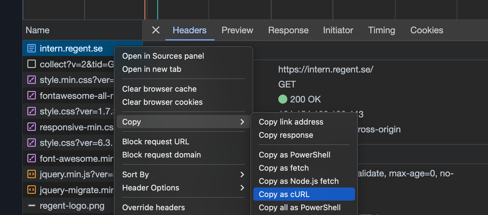

# Regent Rag

[](https://github.com/frgul006/rag-experiment/actions/workflows/ci.yml)

Regent Rag is a collection of Python scripts designed to scrape websites behind cookie-based authentication, transform the textual content into a vector database, and execute queries against this database.

This README provides instructions on how to install, setup and run the scripts locally.

## Installation

### For Windows Users

Installation on Windows can be found under [docs/WINDOWS.md](./docs/WINDOWS.md). Note that the instructions require Windows 10 OS Build 2004 or later.

### Python

Install Python 3.11.6. You can download it from the [official Python website](https://www.python.org/downloads/) or if you're on MacOS using [pyenv](https://github.com/pyenv/pyenv#getting-pyenv).

### Pipenv

Install pipenv using the following command:

```bash
pip install --user pipenv
```

Now ensure `pipenv` is available on `PATH` by running:

```bash
pipenv --version
```

If it's not available you likely need to add `~/.local/bin` to your `PATH`:

```bash
export PATH="$HOME/.local/bin:$PATH"
```

and to persist it, add it to your profile of choice (`~/.profile`, `~/.bash_profile` or `~/.zshrc`)

```bash
echo 'export PATH="$HOME/.local/bin:$PATH"' >> ~/.zshrc
```

Tell pipenv to install virtual environments in project and ensure the LANG environment variable is set:

```bash
export PIPENV_VENV_IN_PROJECT=1 && export LANG="en_US.UTF-8"

```

or to persist:

```bash
echo 'export PIPENV_VENV_IN_PROJECT=1\nexport LANG="en_US.UTF-8"' >> ~/.zshrc
```

You can verify your installation by running:

```bash
pipenv --version
```

### Rust compiler

Ensure you have a rust compiler installed. It's required for `volta`. You can install it (on MacOS) using the following command:

```bash
curl --proto '=https' --tlsv1.2 -sSf https://sh.rustup.rs | sh
```

You can verify your installation by running:

```bash
cargo --version
```

### Install volta

<https://volta.sh/> is a universal JavaScript Tool Manager (replaces nvm for Node version management)

```bash
curl https://get.volta.sh | bash
```

### Install node

```bash
volta install node@18
```

### Install packages

Install all packages (including dev dependencies) using the following command:

```bash
make install-dev
```

### Verify installation

If you are able to run the following set of commands, you should be all set!

```bash
python --version &&
pipenv --version &&
cargo --version &&
node --version &&
volta --version &&
echo $PIPENV_VENV_IN_PROJECT &&
echo $LANG
```

## Usage

### Environment Setup

#### How to create a `.env` file

Create a `.env` file with the keys listed in `.env.sample`:

```env
OPENAI_API_KEY=""
PINECONE_API_KEY=""
PINECONE_INDEX_NAME=""
PINECONE_ENVIRONMENT="gcp-starter"
LOG_LEVEL="INFO"
```

- `OPENAI_API_KEY`: This is your API key for OpenAI. It's used to authenticate your application with OpenAI's services. You can find them here: <https://platform.openai.com/account/api-keys>

- `PINECONE_API_KEY`: This is your API key for [Pinecone](https://app.pinecone.io/). It's used to authenticate your application with Pinecone's services.

- `PINECONE_INDEX_NAME`: This is the name of the index in Pinecone where your vectors will be stored.

- `PINECONE_ENVIRONMENT`: Used to specify the Pinecone environment in which your application is running. If you are using the free tier it should probably be set to `"gcp-starter"`.

- `LOG_LEVEL`: This sets the level of logging for the application. It can be set to different levels like `"INFO"`, `"DEBUG"`, `"ERROR"`, etc. depending on the amount of information you want to log. `"INFO"` is a standard level that will capture most of the important information without being too verbose.

#### How to create a `request.curl` file

You need to copy a request from the network tab of your browser in order to be able to scrape a webpage that requires authentication.

##### IMPORTANT

These instructions may differ from browser to browser and OS to OS. It is _very_ important that the output you paste into `request.curl` follows the exact format specified in `request.curl.sample`.

For example, if on Windows and using Firefox, I'd recommend choosing Copy Value -> Copy Request Headers and then manually fixing the lines to match the format in the sample file.

##### Steps

1. Open the webpage you want to scrape in Google Chrome.
1. Press F12 to open the Developer Tools.
1. Click on the Network tab.
1. Refresh the webpage to start capturing the requests.
1. Look for a request towards the domain of the webpage you want to scrape.
1. Make sure the request contains the necessary cookies for authentication. These are usually found in the Headers section of the request.
1. Right-click on the request and select Copy -> Copy as cURL.
1. Paste the copied request into a new file and save it as `request.curl`.



By following these steps, you'll have a `request.curl` file that contains all the necessary cookies for the scraper to work with authentication.

### Running the scripts

#### Scraping

`make scrape`

#### Loading and splitting

`make splits`

#### Create embeddings and upload to pinecone

`make embeddings`

#### Retrieve data from the vector db

`make retrieval`

### Running the backend application

`make flask`

## References

<https://github.com/Sstobo/Site-Sn33k>
